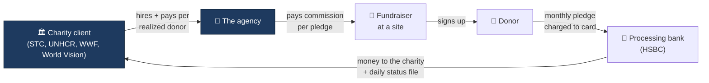
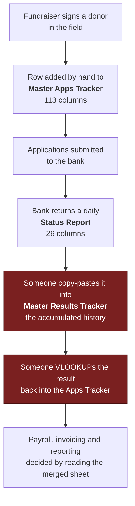
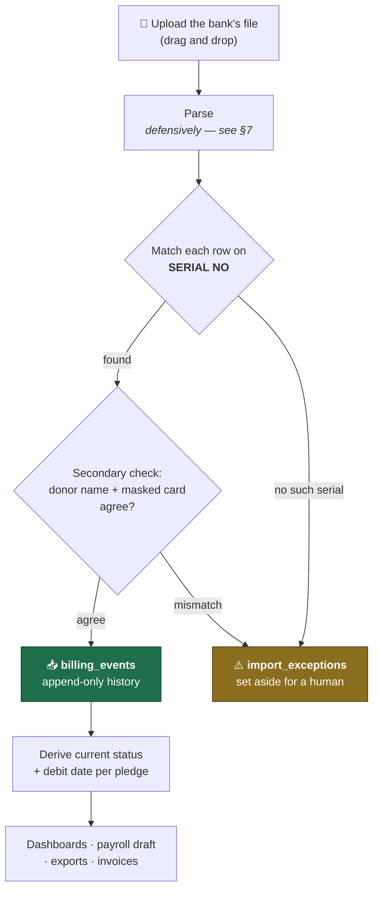
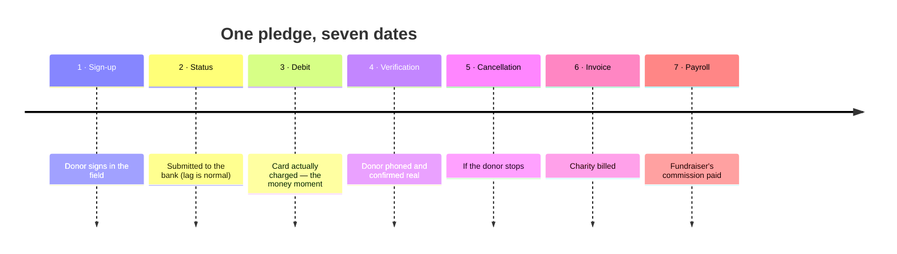
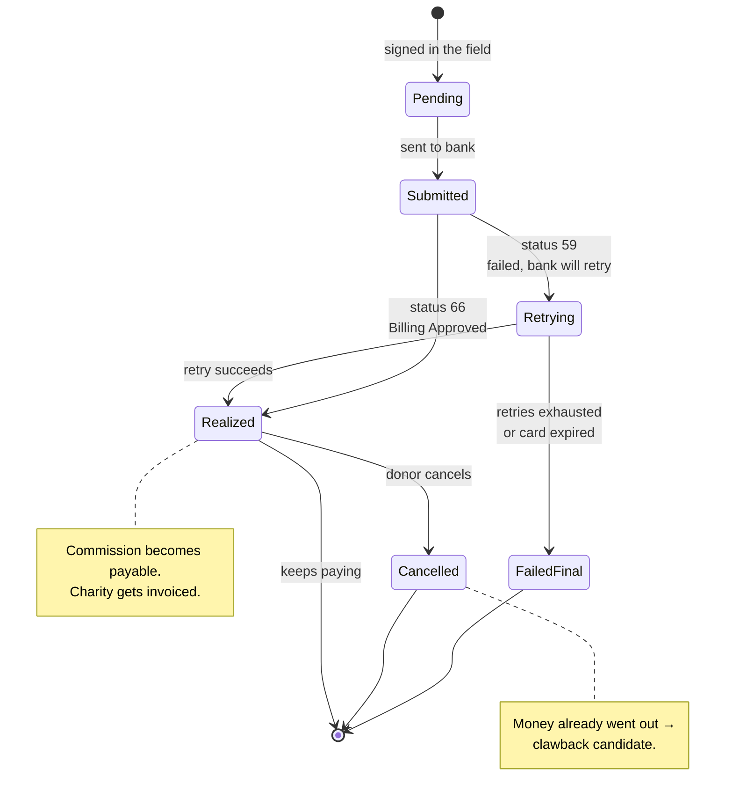
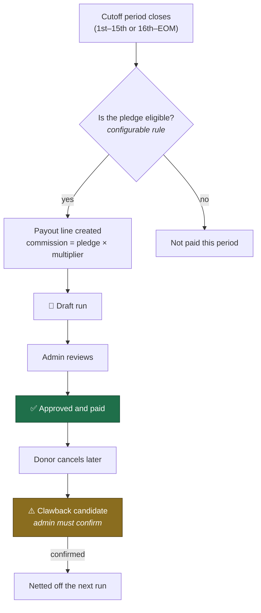
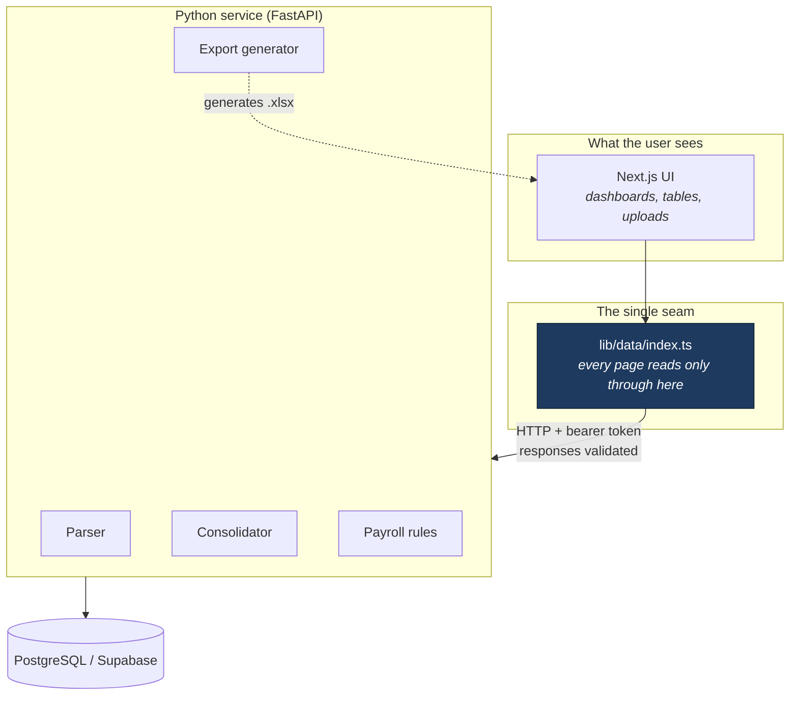
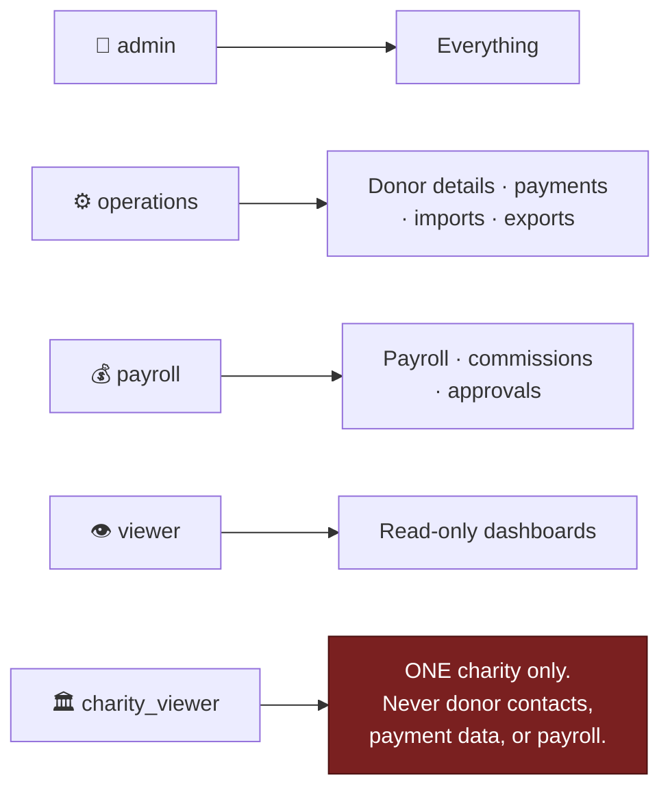

# How the platform works

A visual walkthrough of the business and the system, as we currently
understand it. Written to be readable by the owners, not just developers.

**If anything here is wrong, that is the most valuable feedback we can get** —
every diagram below is an assumption made concrete, and a wrong assumption is
much cheaper to fix on this page than in the code.

Companion documents: `MASTER_SPEC.md` (full spec), `FINDINGS.md` (what the real
sample files proved), `OWNER_MEETING_WORKSHEET.md` (what is still unanswered).

---

## 1. The business in one picture

The agency sits between charities and donors. Three flows of money define
whether a month is profitable.

The catch: **the agency pays the fundraiser before knowing whether the donor's
card will actually be charged.** If the pledge never bills or the donor
cancels, the agency loses twice — it credits the charity back *and* claws the
commission back from the fundraiser.

That is why one number governs everything:

> **Realization rate** — the share of sign-ups that turn into successfully
> billing donors. A high-volume fundraiser with a low realization rate costs
> the agency money.

*(Which denominator that rate uses is currently inconsistent in the app — see
the meeting worksheet, Part 2. It needs a decision.)*

---

## 2. What happens today (the manual process we are replacing)

The two red steps are manual, daily, and the source of most errors. Everything
joins on one key: **`SERIAL NO`** (e.g. `FES48402552`), unique per application.

**The platform automates steps 4–7.** Steps 1–3 stay human.

---

## 3. What the platform does instead

Three rules make this safe to re-run:

1. **A bad row never fails the batch.** It goes to the exceptions queue with
   its raw values, and the other 400 rows still import.
2. **Billing history is append-only.** A status is never overwritten; the
   current status is *derived* from the latest event. You can always see how a
   pledge got where it is.
3. **Re-uploading the same file changes nothing.** Events dedupe on
   `(pledge, status, date)`, so a double upload is harmless.

---

## 4. The seven lifecycle dates

Every report can be filtered on **any** of these dates. This matters more than
it sounds: *"how did we do in July?"* gives a different answer depending on
which date you mean.

Two of these are quality gates rather than bookkeeping:

- **Debit date** is the only proof that real money moved. Sign-ups are a
  promise; debits are revenue.
- **Verification** means a human phoned the donor and confirmed they exist and
  understood what they signed. It catches both honest mistakes and fraud.

Dates 5–7 do not always happen, and 6 and 7 can happen *before* a cancellation
— which is precisely how a clawback is created.

---

## 5. The life of a pledge

**The app never branches on a raw bank code.** Each code carries a
*classification* — approved / failed-retryable / failed-final / cancelled /
other — and the logic reads the classification. When the bank introduces a new
code, an admin adds it in Settings in about thirty seconds. No developer, no
deploy.

Only two codes are confirmed so far (66 approved, 59 failed-retry); the full
dictionary is still owed by the bank.

---

## 6. Payroll and clawbacks

Fundraisers are paid **twice a month**: the 1st–15th in the ~15th run, the
16th–end-of-month in the ~30th run.

Rules that are easy to get wrong, and are deliberately encoded:

- **Eligibility is configurable, never hard-coded.** Default is *on first
  approved billing* — the fundraiser earns when the pledge actually bills, not
  merely when it is signed. The evidence for this default is in FINDINGS §3.7.
- **An unconfirmed clawback never reduces someone's pay.** It sits in a review
  queue until an admin confirms it. Nets *can* go negative.
- **Currencies are never summed.** Fundraisers hold both PHP and MYR pledges;
  each person nets out per currency.
- **A new commission plan never reprices old runs** — plans are effective-dated
  by the pledge's sign-up date.

---

## 7. Why the parser is paranoid

Every one of these was found in the client's real files, not imagined:

| What arrives | Why it breaks naive code |
|---|---|
| Sheets reporting **1,048,570 rows** that hold ~436 | Reading to the reported end processes a million empty rows |
| Sheet names `sheet1`, `Sheet1`, `Sheet2` for the same content | Selecting a sheet by name fails on the next file |
| `=DATE(2026,7,8)` stored as literal text | Treated as a string, the date is lost |
| `=75*13` in an amount cell | Must be evaluated — with a tiny arithmetic parser, never `eval` |
| Expiry `0728` | Parsed as a number it becomes `728`; the leading zero is load-bearing |
| Amounts as `"1,000.00"`, `1000`, and a formula | Three shapes, one meaning |
| Two junk columns, one carrying a real 2-char value | Dropping both silently loses data |

The real files contain donor PII and can never be committed, so the test suite
**generates synthetic .xlsx files that reproduce every trap above** and tests
against those.

---

## 8. How the pieces fit together

The division of labour is strict:

- **The Python service owns all parsing, matching and file generation.** The UI
  never re-implements any of it.
- **Every page reads through one file** (`lib/data/index.ts`). Today those
  functions return mock data; each becomes an HTTP call without changing a
  single page. That is why the UI could be built and reviewed before the
  backend existed.
- **The database schema has one owner** (Drizzle, in the frontend workspace).
  Python reads and writes but never migrates — two migration systems fighting
  over one database is a well-known way to lose a weekend.

---

## 9. Who can see what

The `charity_viewer` restriction is enforced **in the service layer, not just
by hiding buttons** — a charity viewer cannot reach restricted data even by
crafting the request directly. Donor data falls under the Philippine Data
Privacy Act (RA 10173), so this is a legal requirement, not a nicety.

Everything sensitive is audit-logged: every import, export, payroll approval
and settings change, with exports containing PII specifically flagged.

Card numbers are **stored masked only** (`542550XXXXXX2906`). There is
deliberately no column in the database capable of holding a full card number.

---

## 10. Where the build currently stands

```mermaid
flowchart LR
    F["✅ Frontend<br/><i>complete, mock-driven</i>"]
    S["✅ Database schema<br/><i>32 tables, tested</i>"]
    P0["✅ Backend scaffold"]
    P1["🔨 Parser"]
    P2["⬜ Consolidator"]
    P3["⬜ Exports"]
    P4["⬜ API + payroll"]
    P5["⬜ Connect UI to API"]

    F --- S --- P0 --> P1 --> P2 --> P3 --> P4 --> P5

    style F fill:#1f6f4a,stroke:#0d3f28,color:#fff
    style S fill:#1f6f4a,stroke:#0d3f28,color:#fff
    style P0 fill:#1f6f4a,stroke:#0d3f28,color:#fff
    style P1 fill:#8a6d1f,stroke:#4a3a10,color:#fff
```

The UI you have been reviewing runs entirely on realistic mock data. That was
deliberate: it let the owners react to real screens before a line of backend
existed. Connecting it to live data is the last step, not the first.
